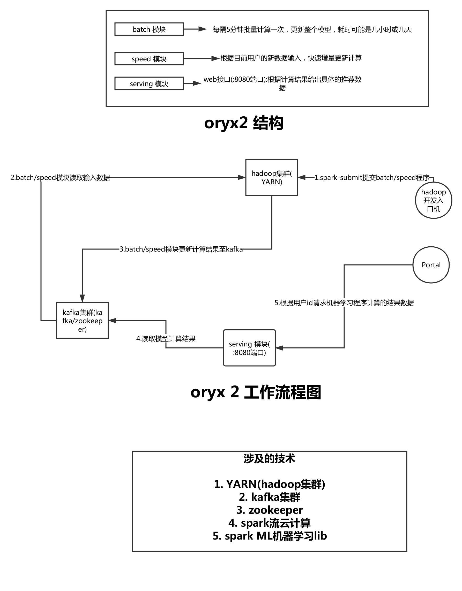

Oryx 2 是对lambda architecture的一个实现,它构建于[Apache Spark](http://spark.apache.org)和[Apache Kafka](http://kafka.apache.org)之上
,专注于大型的实时的机器学习技术.它是一个框架,你可以它用来开发一个自己的应用.但它本身也包含了可以直接拿来用的应用程序模块,可用来做协同过滤,分类(classification)
,回归(regression),集群(clustering)等计算.

猛戳这个链接[Oryx 2 site](http://oryx.io/) 查看完整的文档

你是想马上部署一个已经开发好的现成的机器学习应用么?
你是想用来做协同过滤,回归(regression),集群(clustering)?
简单!!
欧巴马上来教你:

- 先搭建一个 Hadoop 集群,用这个说明书 [Cluster Setup](http://oryx.io/docs/admin.html)
- 下载Oryx 2的最新版,点这里->[Release](https://github.com/OryxProject/oryx/releases)
- 准备一个Oryx 2的配置文件,参考这里(里边有三种配置文件,选择一个你喜欢的) [Configuration Reference](http://oryx.io/docs/endusers.html#Configuration)
- 打开Oryx 2程序,请参考[Running Oryx](http://oryx.io/docs/endusers.html#Running)
- 想知道Oryx 2暴露了那些api可供你调用并获取机器学习运算后的产生的结果么? 看这里 [API Endpoint Reference](http://oryx.io/docs/endusers.html#API_Endpoint_Reference)

如果你是程序猿,你也可以用Oryx 2 作为基础开发框架,开发你自己想要的应用, 请查看下边这个总体架构图,并参考和学习这个->[Making an Oryx App](http://oryx.io/docs/developer.html#Making_an_Oryx_App)

如果你查看上边的那个总体架构图后,还弄不清楚这个玩意到底怎么玩? 恭喜你回归到凡人的种族里来(超人请自便),下边这个是字幕哥自己画的图:

-----------------------------------------

